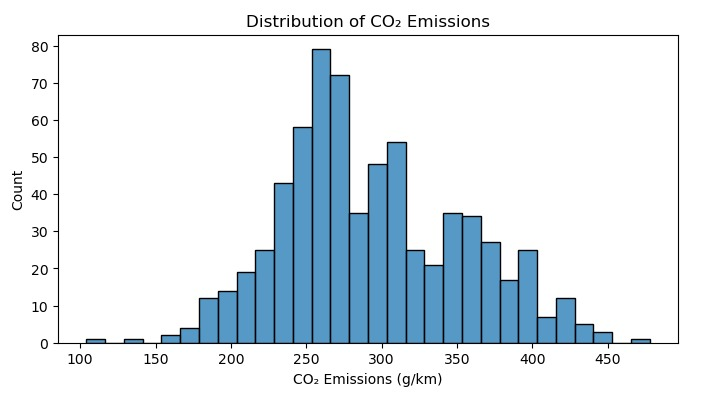
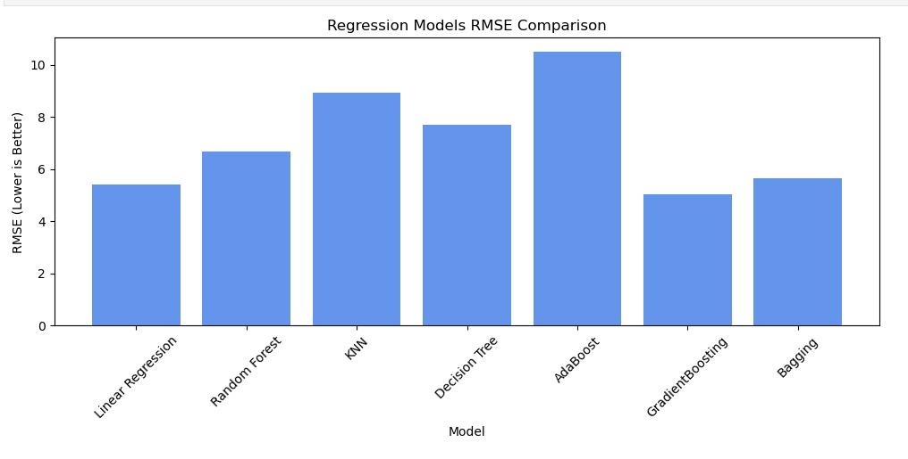
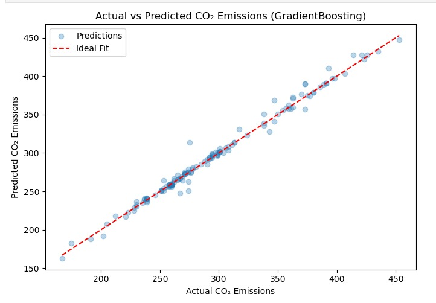
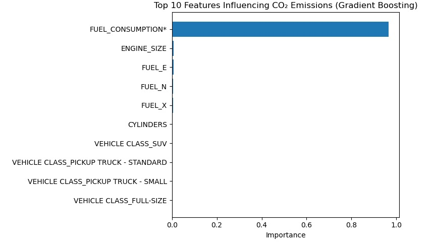
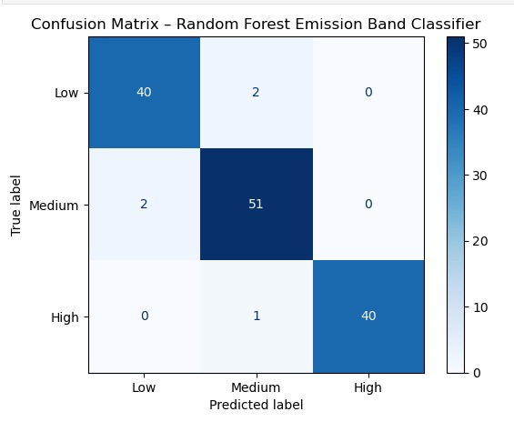

# CO2 Emission Prediction & Classification

Predict vehicle CO2 emissions and classify vehicles into emission categories using machine learning models trained on Canadian vehicle emission data.

---

## Overview

This project applies both regression and classification techniques to analyze vehicle CO2 emissions.

Two machine learning tasks were performed:

| Task | Objective | Best Model |
|--------|------------|------------|
| Regression | Predict exact CO2 emission value (g/km) | Gradient Boosting Regressor |
| Classification | Classify vehicles into emission categories | Random Forest Classifier |

The project demonstrates a complete machine learning workflow including data preprocessing, feature engineering, model training, evaluation, and visualization.

---

## Dataset

**Source:**  
Canadian Vehicle CO2 Emissions Dataset (Kaggle)

https://www.kaggle.com/datasets/isaacfemiogunniyi/co2-emission-of-vehicles-in-canada

### Dataset Information

The dataset is derived from the Canadian Vehicle CO₂ Emissions Dataset available on Kaggle. The project was developed using a filtered subset containing 679 vehicle records, while this repository includes the complete dataset for reference and reproducibility.

### Features

| Feature | Description |
|----------|-------------|
| MODEL | Vehicle model year |
| MAKE | Manufacturer |
| MODEL.1 | Vehicle model |
| VEHICLE CLASS | Vehicle category |
| ENGINE_SIZE | Engine size (L) |
| CYLINDERS | Number of cylinders |
| TRANSMISSION | Transmission type |
| FUEL | Fuel type |
| FUEL_CONSUMPTION* | Combined fuel consumption |
| CO2_EMISSIONS | Target variable |

---

## Project Structure

```text
CO2-Emission-Prediction-Classification/

├── Code/
│   └── ML_FinalProject.ipynb

├── Dataset/
│   └── CO2 Emissions_Canada.csv

├── Images/
│   ├── co2_distribution.jpeg
│   ├── model_comparison.jpeg
│   ├── actual_vs_predicted.jpeg
│   ├── feature_importance.jpeg
│   └── confusion_matrix.jpeg

└── README.md
```

---

## Methodology

### Data Preprocessing

- Data cleaning and validation
- Removal of unnecessary columns
- Handling categorical variables using One-Hot Encoding
- Feature scaling and transformation
- Train-test split for model evaluation

### Regression Models Evaluated

- Linear Regression
- K-Nearest Neighbors Regressor
- Decision Tree Regressor
- AdaBoost Regressor
- Bagging Regressor
- Random Forest Regressor
- Gradient Boosting Regressor

### Classification Models Evaluated

- Logistic Regression
- Decision Tree Classifier
- Support Vector Machine (SVM)
- K-Nearest Neighbors Classifier
- Random Forest Classifier

---

## Results

### Regression Task

Best Model: Gradient Boosting Regressor

Evaluation metrics:

- Lowest RMSE among all tested models
- Strong predictive performance
- High correlation between actual and predicted CO2 values

### Classification Task

Best Model: Random Forest Classifier

Evaluation metrics:

- Highest classification accuracy
- Strong performance across all emission categories
- Reliable classification of low, medium, and high emission vehicles

---

## Key Findings

- Fuel Consumption was the most influential feature affecting CO2 emissions.
- Engine Size and Number of Cylinders also contributed to emission prediction.
- Ensemble learning methods consistently outperformed simpler models.
- Gradient Boosting achieved the best regression performance.
- Random Forest produced the highest classification accuracy.

---

## Visualizations

### CO2 Distribution



### Model Performance Comparison



### Actual vs Predicted CO2 Emissions



### Feature Importance



### Classification Confusion Matrix



---

## Technologies Used

- Python
- Pandas
- NumPy
- Scikit-learn
- Matplotlib
- Seaborn
- Jupyter Notebook

---

## Author

Kshiti Anil Kumar

GitHub:
https://github.com/KshitiAnilKumar

LinkedIn:
https://www.linkedin.com/in/kshitianilkumar/

---

## License

This project is shared for educational and research purposes.
